# Creator-OS Partner Integration — Start Here

**Versioning:** this contract carries the tag of the product release it ships with — the same tag your
installation's image carries. What changed in each release: [changelog.md](./changelog.md).

> This is a specification, not a proposal. The platform defines the contract; the integrating partner
> implements it. There is no back-and-forth required to start building.
>
> This document set is written for **an engineer who has never seen Creator-OS source code, issue
> tracker, or internal design discussion**. Anywhere you have to guess is a bug in the documentation —
> report it and we will fix it.

This page is the entry point. Read it first, then follow the links below for the channel you need.

*(A Vietnamese translation of this entire set is available at [../vi/](../vi/README.md). This English
version is the source of truth — if the two ever disagree, this one wins.)*

---

## Choose the event profile

For anonymous shop orders attributed to a CTV through Program Link, use [program-link.md](program-link.md). Link uses the signed EVENT endpoint, does **not** require Campaign LAUNCH, and permits absent externalUserId only in valid LINK_ORDER_* / PROGRAM_LINK envelopes. Buyer identity is not the CTV receiving the commission. The Reward/session rules below apply to legacy Reward activity, not this Link profile.

## What this integration does

Creator-OS turns real-world activity from your system — completed orders, cancellations, in-app
actions — into rewards for your users: points, entitlements, unlocked content. To make that work, two
independent channels connect your system to ours, and two more are optional:

| Channel | Answers the question | Document |
|---|---|---|
| **EVENT** | "What did the user just do?" | [program-link.md](./program-link.md) | Anonymous Link tracking, order lifecycle, SKU mapping, signing, ACK and recovery |
| [event-ingestion.md](./event-ingestion.md) |
| **LAUNCH** *(Campaign Launch)* | "Who just opened the app, for which campaign?" | [campaign-launch.md](./campaign-launch.md) |
| **RECOVERY** *(optional)* | "What did you send us in this window?" — **we** call **you** | [recovery.md](./recovery.md) |
| **SETTLEMENT** *(optional)* | "This point amount is settled — please handle it" — **we** call **you**, and you report back with `POINT_REDEEMED` | [settlement.md](./settlement.md) |

All channels use the same `accessKey`. You keep one `masterSecret` and derive an isolated key for each
channel with [`IntegrationCredentialDerivationV1`](./credential-derivation.md).

---

## What Creator-OS provides you

- **One Access Key** (`accessKey`) — shared across all channels, case-insensitive.
- **One Master Secret** (`masterSecret`) — displayed once. You derive separate channel keys from it:
  1. **EVENT** Secret Key — we use it to verify the signature on events you send.
  2. **LAUNCH** Secret Key — we use it to verify the signature on Campaign Launch requests you send (see [campaign-launch.md](./campaign-launch.md)).
  3. **RECOVERY** Secret Key *(only if you build a recovery endpoint)* — **we** use it to sign requests when we call you.
  4. **SETTLEMENT** Secret Key *(only if you declare a `settlement_endpoint`)* — **we** use it to sign point-settlement notifications, see [settlement.md](./settlement.md).
- A sandbox environment and a self-service conformance test suite.
- **The host of the environment you are using** — we tell you at hand-over. Every example in this documentation set writes `https://<the host of the environment you are using>/api/v1`; replace it with the value we send you, and do NOT guess it from the domain of the admin portal.
- **The host of the test environment we gave you** — used ONLY where an example must not reach production: the conformance suite (each run sends 8–10 real events with the `conf-` prefix) and the sample settlement send in [testing.md §1.7](./testing.md#17-send-yourself-a-test-settlement-notification-sandbox-only), which exists only on the test environment and answers `404` elsewhere. Examples write `https://<the host of the test environment we gave you>/api/v1`.
- An event source code — maps the `type` you send to our internal system.

## What you provide Creator-OS

- A server that can compute **HKDF-SHA256** *(to derive each channel key from `masterSecret`)* and
  **HMAC-SHA256** *(to sign)*. Each channel has its own key, but **you derive them** — we only issue
  the `masterSecret`. See [credential-derivation.md](./credential-derivation.md).
- **EVENT channel**: business events from your system (orders, UI actions) via `POST /api/v1/integrations/events`, called **from your server**.
- **LAUNCH channel**: a request to bootstrap a session for an already-known user, via `POST /api/v1/campaigns/:campaignId/launch`, called **from your server** — see [campaign-launch.md](./campaign-launch.md).
- *(optional)* A recovery endpoint on your side — so we can ask you what you sent when we need to reconcile or backfill.

---

## ⭐ Required order for legacy Reward: LAUNCH before EVENT

**This section applies to legacy Reward profiles. It does not apply to PROGRAM_LINK; use [the Link guide](program-link.md) for tracking/capture prerequisites.**

The two Reward channels are not interchangeable options.

🔴 **LAUNCH establishes the user's Creator-OS session. EVENT reports the user's activity. Both are
required for partner-reported activity to produce a reward** — LAUNCH is a prerequisite, not an
alternative to EVENT. An event only produces a reward for a user if that user **already has at least one
established session** through the LAUNCH channel — once is enough, it does not need to repeat every
session. (Other conditions — an active campaign window, a sufficient `confidence` level — also apply;
see [event-ingestion.md](./event-ingestion.md).)

Sending an event for a user who has **never** gone through LAUNCH: we still return `200`, we still
**receive and store** the event verbatim — but it **never produces a reward, not even retroactively**
(there is no "catch-up" mechanism for a late session). And today **there is no warning or error code**
telling you this happened — the API call looks exactly as successful as one that did produce a reward.

⇒ Integrating **EVENT only, with no LAUNCH at all**, is only useful for **raw data logging /
reconciliation**. It does **not** reward real users. If your goal is for users to actually receive
points or entitlements, you **must** integrate both channels.

🔴 **`externalUserId` MUST be the exact same value — same format, same case — on both the EVENT channel
and the LAUNCH channel, for the same user.** This is the single most time-consuming bug in this entire
integration: any mismatch — even a casing difference or an added prefix — means the session establishes
normally but the user **never receives a reward**, and **no error fires** to reveal it. Use exactly one
internal variable to produce both values; do not let two teams (login vs. orders) mint separate IDs for
the same person.

---

## Identifier semantics — one table, four identifiers

This integration uses four distinct identifiers. Confusing any two of them is the most common source of
integration bugs. Each row is defined once here; the channel documents link back to this table instead
of repeating it.

| Identifier | Channel | Generated by | Scope | Retry / reuse behavior |
|---|---|---|---|---|
| `eventId` | EVENT | **you** | one business event | retry MUST reuse the **same** id |
| `deliveryId` | EVENT | **us** | one delivery attempt | a new one **may** be issued per attempt |
| `externalUserId` (legacy Reward) | EVENT + LAUNCH | **you** | one user, shared across both channels | MUST be the exact same value on both channels for the same user (§ above) |
| `launchCode` | LAUNCH | **us** | one launch attempt | single-use, issued at step 1, 60-second lifetime — see [campaign-launch.md](./campaign-launch.md#6-launch-grant--security-invariants-frozen-do-not-implement-around-them) |

⚠️ **`eventId` and `launchCode` have opposite retry rules.** `eventId` identifies a business event —
resending it with the same value is safe and expected. `launchCode` identifies one launch attempt — it
is consumed on first use and cannot be reused; call step 1 again for a new one. Do not apply one
channel's retry logic to the other.

---

## Legacy Reward integration checklist

For Link, use the separate [Link integration checklist](program-link.md#9-integration-verification-checklist).

```text
[ ] Implement EVENT sender (HMAC-SHA256 signing, POST /api/v1/integrations/events)
[ ] Implement LAUNCH (two-step flow, POST /api/v1/campaigns/:campaignId/launch + GET /api/v1/launch)
[ ] Use the SAME externalUserId value for the same user on both channels
[ ] Implement RECOVERY endpoint (OPTIONAL — see recovery.md)
[ ] Receive point settlements (OPTIONAL — see settlement.md): give our ops an https:// address · derive the SETTLEMENT key · verify the signature on the RAW body · keep a log of seen deliveryNonce values and answer 409 for a repeat (and for nothing else) · send POINT_REDEEMED for every line you paid
[ ] Handle 2xx (200 = accepted, including duplicates)
[ ] Handle 4xx (400/401/403/404/409/422 — see error-codes.md)
[ ] Handle 429 (read Retry-After, back off)
[ ] Handle 5xx (retry with backoff)
[ ] Preserve eventId across retries of the same business event
[ ] Verify deduplication works (send the same eventId twice, confirm the second is deduplicated)
[ ] Run the conformance test suite against sandbox (testing.md)
[ ] Pass the inbound conformance cases (8/8 — this is a go-live gate)
[ ] Complete the production checklist (testing.md)
```

---

## The whole round trip

```mermaid
flowchart LR
  A[Your server creates a launchUrl] --> B[Your app opens it in the web view]
  B --> C[The player acts in the web view]
  C --> D[Your server sends events]
  D --> E[We turn events into points and close the period]
  E --> F[Our operations team sends the settled amounts to your endpoint]
  F --> G[You pay the player and answer 2xx]
  G --> H[You send POINT_REDEEMED for each paid line]
  H --> I[The line is closed]
```



| Step | What happens | Read |
|---|---|---|
| 1 | your server asks for a `launchUrl` for one player | [campaign-launch.md §4](./campaign-launch.md#4-step-1--create-a-launch-grant) |
| 2 | your app opens that URL unchanged in a web view that keeps cookies | [webview.md](./webview.md) |
| 3 | the player acts; your server reports each business event | [event-ingestion.md](./event-ingestion.md) |
| 4 | we turn qualifying events into points and, at the end of a period, close it | *(our side)* |
| 5 | our operations team sends each settled amount to your `settlement_endpoint` | see the settlement document, section 2 |
| 6 | you pay the player, answer `2xx` (or `409` for a repeat) | see the settlement document, sections 2.2 and 4 |
| 7 | you report each payment as a `POINT_REDEEMED` event so the line closes | [event-ingestion.md](./event-ingestion.md) |

Steps 5 to 7 apply only if you receive point settlements ([settlement.md](./settlement.md)). Before real
users: [go-live.md](./go-live.md).

## Machine-readable specification

[`openapi.yaml`](../openapi.yaml) (OpenAPI 3.1) describes every partner door, the HMAC headers of each
channel, and the settlement packet we send you (under `webhooks`). One JSON Schema per request body is in
[`schemas/`](../schemas/). They are generated from the validators our server runs, so they do not drift.
JSON Schema cannot show every check; the extra checks are listed under `x-serverSideChecks` in each schema.
Ready-made requests that sign themselves are in `examples/bruno/` and `examples/postman/` of this repository
(a Bruno and a Postman collection: set `baseUrl`, `accessKey` and `masterSecret`, then send).

---

## Document map

| Document | Covers |
|---|---|
| [program-link.md](./program-link.md) | Anonymous Link tracking, order lifecycle, SKU mapping, signing, ACK and recovery |
| [event-ingestion.md](./event-ingestion.md) | EVENT channel: authentication, request schema, responses, retry, rate limits |
| [campaign-launch.md](./campaign-launch.md) | LAUNCH channel: two-step flow, Launch Grant invariants, session |
| [recovery.md](./recovery.md) | Optional reconciliation and backfill capability |
| [settlement.md](./settlement.md) | Optional — we notify you when a POINT settlement is ready |
| [error-codes.md](./error-codes.md) | Consolidated error reference across all channels |
| [testing.md](./testing.md) | Conformance test suite |
| [webview.md](./webview.md) | Embedding the web view: cookies, native bridge, session |
| [go-live.md](./go-live.md) | The go-live checklist and the incident runbook |
| [openapi.yaml](../openapi.yaml) | Machine-readable specification (OpenAPI 3.1) and [JSON Schemas](../schemas/) |
| [credential-derivation.md](./credential-derivation.md) | HKDF contract, versions, test vectors, and rotation |
| [changelog.md](./changelog.md) | Version history |

The documents above are the **generic contract** — they apply to every partner as written, with no
partner-specific customization.

---

## Notation

| | |
|---|---|
| ⚠️ | Common mistake — read carefully |
| 🔴 | More severe than ⚠️ — getting this wrong usually **fails silently**, with no error to alert you |
| 🔒 | Security-relevant |
| ⭐ | Time-saving tip |
| **MUST / MUST NOT** | Normative requirement — not optional |
| **MAY / OPTIONAL** | Your choice — no penalty either way |

Timestamp conventions **can differ per field within a document** (e.g. ISO-8601 for a business
timestamp like `occurredAt` vs. Unix seconds for a signing `X-Timestamp` header) — see the top of each
document, do not assume they match.

---

## Contact and changes

Anywhere you have to guess is a bug in this documentation — report it and we will fix it and publish a
new version. See [changelog.md](./changelog.md) for version history.
