# Tích hợp với Creator-OS — tài liệu cho đội kỹ thuật bên đối tác

*(bản dịch tiếng Việt của [en/README.md](../en/README.md) — bản tiếng Anh là nguồn chốt, lệch thì bản
tiếng Anh thắng)*

**Phiên bản:** hợp đồng mang đúng thẻ của bản phát hành sản phẩm chứa nó — cũng là thẻ mà image bản cài
của bạn mang. Mỗi bản đổi gì: [changelog.md](./changelog.md).

> **Đây là đặc tả, không phải đề xuất.** Nền tảng quyết định và công bố; bên đối tác làm theo. Không có
> vòng hỏi–đáp nào chặn việc của bạn.
>
> Tài liệu viết cho **một đội chưa từng đọc mã nguồn của chúng tôi**. Chỗ nào bạn phải đoán là **lỗi của
> tài liệu** — báo lại, chúng tôi sửa.

Trang này là **điểm vào chung** — đọc trước khi mở một trong hai tài liệu kỹ thuật bên dưới.

---

## Chọn event profile

Đơn shop không cần buyer đăng nhập, quy công CTV bằng Program Link: đọc [program-link.md](program-link.md). Link dùng EVENT ký trên server, **không** cần Campaign LAUNCH, chỉ cho phép thiếu externalUserId với envelope LINK_ORDER_* / PROGRAM_LINK hợp lệ. Buyer không là CTV hưởng. Quy tắc Reward/session bên dưới áp dụng legacy Reward, không áp profile Link này.

## Tích hợp này làm gì

Creator-OS biến hoạt động thật trong hệ thống của bạn — đơn hàng hoàn tất, đơn bị huỷ, hành vi trong
ứng dụng — thành quyền lợi cho người dùng: điểm, entitlement, nội dung mở khoá. Để làm được việc đó, hai
kênh độc lập nối hệ thống của bạn với chúng tôi, và hai kênh nữa là tuỳ chọn:

| Kênh | Trả lời câu hỏi | Tài liệu |
|---|---|---|
| **EVENT** | "người dùng vừa **làm gì**?" | [program-link.md](./program-link.md) | Link anonymous: tracking, vòng đời đơn, SKU mapping, ký, ACK và recovery |
| [event-ingestion.md](./event-ingestion.md) |
| **LAUNCH** *(Campaign Launch)* | "người vừa mở ứng dụng **là ai**, cho campaign nào?" | [campaign-launch.md](./campaign-launch.md) |
| **RECOVERY** *(tuỳ chọn)* | "bạn đã gửi gì cho chúng tôi trong khoảng này?" — **chúng tôi** gọi **bạn** | [recovery.md](./recovery.md) |
| **SETTLEMENT** *(tuỳ chọn)* | "khoản điểm này đã chốt — xin xử lý" — **chúng tôi** gọi **bạn**, và bạn báo lại bằng `POINT_REDEEMED` | [settlement.md](./settlement.md) |

Mọi kênh dùng chung một `accessKey`. Bạn giữ một `masterSecret` và dẫn xuất khoá riêng cho từng
kênh theo [`IntegrationCredentialDerivationV1`](./credential-derivation.md).

---

## Creator-OS cung cấp cho bạn

- **Một Access Key** (`accessKey`) — dùng chung cho mọi kênh, không phân biệt hoa/thường.
- **Một Master Secret** (`masterSecret`) — chỉ hiện một lần. Từ đó bạn dẫn xuất khoá riêng từng kênh:
  1. Khoá kênh **EVENT** — chúng tôi dùng để verify chữ ký sự kiện bạn gửi.
  2. Khoá kênh **LAUNCH** — chúng tôi dùng để verify chữ ký request Campaign Launch bạn gửi (xem [campaign-launch.md](./campaign-launch.md)).
  3. Khoá kênh **RECOVERY** *(chỉ dùng nếu bạn dựng đường phục hồi)* — để **chúng tôi** ký khi gọi sang bạn.
  4. Khoá kênh **SETTLEMENT** *(chỉ dùng nếu bạn khai `settlement_endpoint`)* — để **chúng tôi** ký khi báo tất toán điểm, xem [settlement.md](./settlement.md).

  🔴 **Bốn khoá trên chúng tôi KHÔNG gửi cho bạn** — bạn tự dẫn xuất từ `masterSecret`. Chúng tôi chỉ
  báo kèm **số version của từng kênh** *(thường bắt đầu từ `1`)*, vì version nằm trong chuỗi `info`.
- Môi trường thử nghiệm + bộ kiểm hợp chuẩn tự chạy (conformance test suite).
- **Host của môi trường bạn đang dùng** — chúng tôi báo khi bàn giao. Mọi ví dụ trong bộ tài liệu này
  viết `https://<host của môi trường bạn đang dùng>/api/v1`; thay bằng giá trị chúng tôi gửi, KHÔNG
  đoán từ tên miền của cổng quản trị.
- **Host của môi trường thử chúng tôi đã cấp** — CHỈ dùng ở chỗ ví dụ không được chạm tới production: bộ kiểm hợp chuẩn (mỗi lượt chạy bắn 8–10 sự kiện thật tiền tố `conf-`) và lượt gửi thử thông báo tất toán ở [testing.md §1.7](./testing.md#17-tự-gửi-thử-một-thông-báo-tất-toán-chỉ-ở-sân-sandbox), chỉ có ở môi trường thử, nơi khác trả `404`. Ví dụ viết `https://<host của môi trường thử chúng tôi đã cấp>/api/v1`.
- Mã nguồn sự kiện — ánh xạ `type` bạn gửi sang hệ thống nội bộ của chúng tôi.

## Bạn cung cấp cho Creator-OS

- Một máy chủ tính được **HKDF-SHA256** *(để dẫn xuất khoá từng kênh từ `masterSecret`)* và
  **HMAC-SHA256** *(để ký)*. Mỗi kênh một khoá riêng, nhưng **bạn dẫn xuất chúng** — chúng tôi chỉ
  phát `masterSecret`. Xem [credential-derivation.md](./credential-derivation.md).
- **Kênh EVENT**: sự việc xảy ra trong hệ thống của bạn (đơn hàng, hành vi giao diện) — gửi qua `POST /api/v1/integrations/events`, gọi **từ máy chủ của bạn**.
- **Kênh LAUNCH**: yêu cầu khởi tạo session cho một người dùng đã biết — gửi qua `POST /api/v1/campaigns/:campaignId/launch`, gọi **từ máy chủ của bạn** — xem [campaign-launch.md](./campaign-launch.md).
- *(tuỳ chọn)* Một endpoint phục hồi phía bạn — để chúng tôi hỏi ngược khi cần đối soát/lấp chỗ thiếu.

---

## ⭐ Thứ tự bắt buộc cho legacy Reward: LAUNCH trước EVENT

**Mục này chỉ áp dụng legacy Reward. Không áp PROGRAM_LINK; đọc [guide Link](program-link.md) về tracking/capture prerequisites.**

Hai kênh Reward không là hai lựa chọn ngang hàng.

🔴 **LAUNCH thiết lập Creator-OS session của người dùng. EVENT báo cáo hoạt động của người dùng. Cả hai
đều BẮT BUỘC để hoạt động do đối tác báo cáo sinh ra quyền lợi** — LAUNCH là điều kiện tiên quyết, không
phải một lựa chọn thay thế cho EVENT. Một sự kiện chỉ sinh quyền lợi cho người dùng nếu người dùng đó
**đã có ít nhất một session được establish** qua kênh LAUNCH từ trước — một lần là đủ, không cần lặp lại
mỗi phiên. (Các điều kiện khác — cửa sổ chương trình đang mở, mức `confidence` đủ — cũng áp dụng; xem
[event-ingestion.md](./event-ingestion.md).)

Gửi sự kiện cho người dùng **chưa từng** qua LAUNCH: chúng tôi vẫn trả `200`, vẫn **nhận và lưu** nguyên
văn — nhưng **không bao giờ sinh quyền lợi, kể cả về sau** (không có cơ chế "truy lĩnh" cho session
muộn). Và hiện tại **không có cảnh báo hay mã lỗi nào** báo cho bạn biết điều này đang xảy ra — lượt gọi
API trông thành công y hệt một lượt có sinh quyền lợi.

⇒ Tích hợp **chỉ kênh EVENT, bỏ hẳn LAUNCH** chỉ có ích cho mục đích **lưu vết/đối soát dữ liệu thô**.
Nó **không** trao quyền lợi cho người dùng thật. Nếu mục tiêu của bạn là người dùng thật sự nhận được
điểm/quyền lợi, bạn **bắt buộc** phải tích hợp cả hai kênh.

🔴 **`externalUserId` PHẢI là cùng một giá trị — cùng định dạng, cùng hoa/thường — trên CẢ kênh EVENT
lẫn kênh LAUNCH, cho cùng một người dùng.** Đây là lỗi tốn thời gian debug nhất trong toàn bộ tích hợp:
lệch nhau — dù chỉ khác hoa/thường hay thêm một tiền tố — thì session vẫn establish bình thường nhưng
người dùng **không bao giờ nhận quyền lợi**, và **không lỗi nào nổ ra** để bạn phát hiện. Dùng đúng MỘT
biến nội bộ để sinh ra cả hai giá trị này, đừng để hai đội (đội đăng nhập / đội đơn hàng) tự đặt id
riêng cho cùng một người dùng.

---

## Ngữ nghĩa định danh — một bảng, bốn định danh

Tích hợp này dùng bốn định danh khác nhau. Nhầm lẫn giữa hai cái bất kỳ là nguồn lỗi phổ biến nhất.
Mỗi dòng chỉ định nghĩa MỘT LẦN ở đây; các tài liệu kênh khác trỏ lại bảng này thay vì lặp lại.

| Định danh | Kênh | Ai sinh ra | Phạm vi | Hành vi gửi lại/tái dùng |
|---|---|---|---|---|
| `eventId` | EVENT | **bạn** | một sự việc kinh doanh | gửi lại PHẢI dùng lại **cùng** id |
| `deliveryId` | EVENT | **chúng tôi** | một lượt giao | mỗi lượt **có thể** cấp id mới |
| `externalUserId` (legacy Reward) | EVENT + LAUNCH | **bạn** | một người dùng, dùng chung cả hai kênh | PHẢI là cùng một giá trị ở cả hai kênh cho cùng người dùng (mục trên) |
| `launchCode` | LAUNCH | **chúng tôi** | một lượt launch | dùng một lần, cấp ở bước 1, sống 60 giây — xem [campaign-launch.md](./campaign-launch.md#6-launch-grant--bất-biến-bảo-mật-đã-đóng-băng-đừng-tìm-cách-lách) |

⚠️ **`eventId` và `launchCode` có quy tắc gửi lại NGƯỢC nhau.** `eventId` định danh một sự việc kinh
doanh — gửi lại cùng giá trị là an toàn và được khuyến khích. `launchCode` định danh một lượt launch —
nó bị tiêu thụ ngay lần dùng đầu và không tái dùng được; gọi lại bước 1 để lấy cái mới. Đừng áp logic
gửi lại của kênh này cho kênh kia.

---

## Checklist tích hợp legacy Reward

Đối với Link, dùng [checklist Link riêng](program-link.md#9-checklist-tích-hợp).

```text
[ ] Dựng bộ gửi EVENT (ký HMAC-SHA256, POST /api/v1/integrations/events)
[ ] Dựng luồng LAUNCH (2 bước, POST /api/v1/campaigns/:campaignId/launch + GET /api/v1/launch)
[ ] Dùng CÙNG giá trị externalUserId cho cùng một người dùng ở cả hai kênh
[ ] Dựng endpoint RECOVERY (TUỲ CHỌN — xem recovery.md)
[ ] Nhận gói tất toán điểm (TUỲ CHỌN — xem settlement.md): đưa ops một địa chỉ https:// · dẫn xuất khoá SETTLEMENT · kiểm chữ ký trên thân THÔ · lưu sổ deliveryNonce đã thấy và trả 409 khi trùng (và không cho việc gì khác) · gửi POINT_REDEEMED cho mọi dòng đã trả
[ ] Xử lý 2xx (200 = đã nhận, kể cả bản trùng)
[ ] Xử lý 4xx (400/401/403/404/409/422 — xem error-codes.md)
[ ] Xử lý 429 (đọc Retry-After, chờ rồi thử lại)
[ ] Xử lý 5xx (gửi lại có backoff)
[ ] Giữ nguyên eventId qua mọi lượt gửi lại của cùng một sự việc
[ ] Xác nhận chống trùng hoạt động (gửi cùng eventId hai lần, xem lượt hai bị deduplicated)
[ ] Chạy bộ kiểm hợp chuẩn trên sandbox (testing.md)
[ ] Đạt các ca kiểm chiều VÀO (8/8 — đây là điều kiện lên thật)
[ ] Hoàn tất checklist trước khi lên thật (testing.md)
```

---

## Cả vòng đi trọn vẹn

```mermaid
flowchart LR
  A[Máy chủ của bạn tạo launchUrl] --> B[App của bạn mở nó trong web view]
  B --> C[Người chơi thao tác trong web view]
  C --> D[Máy chủ của bạn gửi sự kiện]
  D --> E[Chúng tôi đổi sự kiện thành điểm và chốt kỳ]
  E --> F[Ops của chúng tôi gửi số đã tất toán tới điểm cuối của bạn]
  F --> G[Bạn trả cho người chơi và trả lời 2xx]
  G --> H[Bạn gửi POINT_REDEEMED cho mỗi dòng đã trả]
  H --> I[Dòng được đóng]
```



| Bước | Điều xảy ra | Đọc |
|---|---|---|
| 1 | máy chủ của bạn xin một `launchUrl` cho một người chơi | [campaign-launch.md §4](./campaign-launch.md#4-bước-1--tạo-launch-grant) |
| 2 | app của bạn mở đúng nguyên URL đó trong web view có giữ cookie | [webview.md](./webview.md) |
| 3 | người chơi thao tác; máy chủ của bạn báo từng sự việc kinh doanh | [event-ingestion.md](./event-ingestion.md) |
| 4 | chúng tôi đổi sự kiện đủ điều kiện thành điểm và, cuối kỳ, chốt kỳ | *(phía chúng tôi)* |
| 5 | ops của chúng tôi gửi từng khoản đã tất toán tới `settlement_endpoint` của bạn | xem tài liệu tất toán, mục 2 |
| 6 | bạn trả cho người chơi, trả lời `2xx` (hoặc `409` cho lượt lặp) | xem tài liệu tất toán, mục 2.2 và 4 |
| 7 | bạn báo mỗi khoản đã trả bằng một sự kiện `POINT_REDEEMED` để dòng đóng lại | [event-ingestion.md](./event-ingestion.md) |

Bước 5 đến 7 chỉ áp dụng nếu bạn nhận tất toán điểm ([settlement.md](./settlement.md)). Trước khi có người
dùng thật: [go-live.md](./go-live.md).

## Đặc tả máy đọc

[`openapi.yaml`](../openapi.yaml) (OpenAPI 3.1) mô tả mọi cửa đối tác, tiêu đề HMAC của từng kênh, và gói
tất toán chúng tôi gửi bạn (ở mục `webhooks`). Mỗi thân yêu cầu có một JSON Schema trong
[`schemas/`](../schemas/). Chúng được sinh ra từ chính bộ kiểm hợp lệ mà máy chủ chạy nên không trôi. JSON
Schema không diễn tả hết mọi phép kiểm; các phép kiểm thêm được liệt kê ở `x-serverSideChecks` trong từng
schema. Request làm sẵn, tự ký, nằm ở `examples/bruno/` và `examples/postman/` của kho này (một bộ Bruno và
một bộ Postman: đặt `baseUrl`, `accessKey`, `masterSecret` rồi gửi).

---

## Bản đồ tài liệu

| Tài liệu | Nội dung |
|---|---|
| [program-link.md](./program-link.md) | Link anonymous: tracking, vòng đời đơn, SKU mapping, ký, ACK và recovery |
| [event-ingestion.md](./event-ingestion.md) | Kênh EVENT: xác thực, schema request, response, gửi lại, giới hạn tần suất |
| [campaign-launch.md](./campaign-launch.md) | Kênh LAUNCH: luồng 2 bước, bất biến Launch Grant, phiên |
| [recovery.md](./recovery.md) | Năng lực đối soát và lấp lại (tuỳ chọn) |
| [settlement.md](./settlement.md) | Chúng tôi báo bạn khi có khoản tất toán ĐIỂM (tuỳ chọn) |
| [error-codes.md](./error-codes.md) | Tra cứu mã lỗi hợp nhất cho mọi kênh |
| [testing.md](./testing.md) | Bộ kiểm hợp chuẩn |
| [webview.md](./webview.md) | Nhúng web view: cookie, cầu nối native, phiên |
| [go-live.md](./go-live.md) | Checklist lên thật và sổ tay xử lý sự cố |
| [openapi.yaml](../openapi.yaml) | Đặc tả máy đọc (OpenAPI 3.1) và [JSON Schema](../schemas/) |
| [credential-derivation.md](./credential-derivation.md) | Hợp đồng HKDF, version, vector kiểm thử và xoay khoá |
| [changelog.md](./changelog.md) | Lịch sử phiên bản |

Các tài liệu trên là **hợp đồng chung** — áp dụng nguyên văn cho mọi đối tác, không tuỳ biến riêng cho
ai.

---

## Quy ước ký hiệu

| | |
|---|---|
| ⚠️ | Lỗi hay gặp — đọc kỹ |
| 🔴 | Nghiêm trọng hơn ⚠️ — sai chỗ này thường **hỏng câm**, không có lỗi nào báo cho bạn biết |
| 🔒 | Liên quan an toàn |
| ⭐ | Mẹo tiết kiệm thời gian |
| **MUST / MUST NOT** | Yêu cầu bắt buộc — không tuỳ chọn |
| **MAY / OPTIONAL** | Tuỳ bạn chọn — không bên nào bị phạt |

Quy ước mốc thời gian **có thể khác nhau theo từng TRƯỜNG trong một tài liệu** (vd ISO-8601 cho mốc
nghiệp vụ như `occurredAt` vs. giây epoch cho header ký `X-Timestamp`) — xem phần đầu mỗi tài liệu,
đừng suy đoán dùng chung.

---

## Liên hệ và thay đổi

Chỗ nào trong tài liệu này bạn **phải đoán** là **lỗi của tài liệu** — báo lại, chúng tôi sửa và phát
hành bản mới. Xem [changelog.md](./changelog.md) để biết lịch sử phiên bản.
